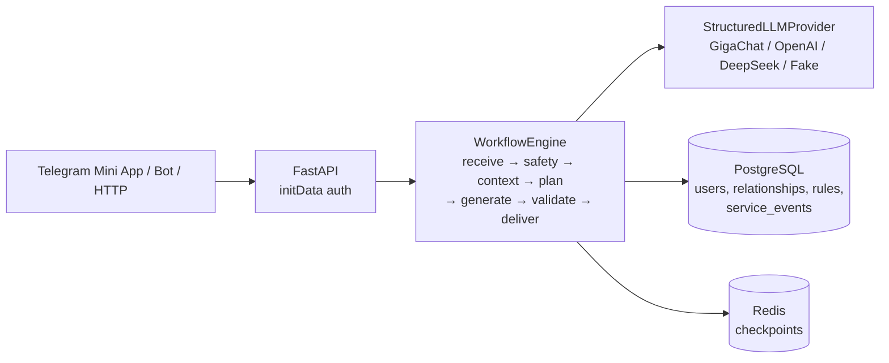

# Svoi Pravila (Свои Правила) v0.6

Svoi Pravila is a Telegram Mini App that helps people communicate with the important people in their lives. Each person has their own rules. The app rewrites a message so it lands better (**soften**), explains a received message (**decode**), or drafts what the user wants to say (**help-say**). Every result follows rules the user defined for that specific relationship.

The backend is a deterministic, modular-monolith FastAPI service. Python controls the workflow; the LLM only reasons inside one stage.

## What problem it solves

Generic AI rewriters ignore context: the same sentence should sound different to a partner, a parent or a boss. Svoi Pravila stores **relationship-specific rules** (phrases to avoid, tone, priorities) as data. It applies them on every request and checks them deterministically, so the output follows the user's own rules, not a generic style.

## Core product loop

```text
open Mini App → pick relationship (or default) → enter text/intention
  → workflow loads that relationship's rules → one LLM call (result + self-check)
  → deterministic validation (retry only if it fails) → result shown
```

## Features

| Feature | Status |
|---|---|
| Telegram Mini App (React/TS) served from `/miniapp/`, Telegram Bot webhook | Implemented, tested |
| Workflows `soften`, `decode`, `help-say` | Implemented, tested |
| Relationships, aliases, communication style, prioritized rules, default relationship | Implemented, tested |
| Telegram `initData` HMAC authentication and per-user ownership isolation | Implemented, tested |
| One-call structured generation with internal self-check, plus deterministic validation and bounded retry | Implemented, tested |
| Multilingual architecture (request `language`, skill prompts); Russian is the primary UI language | Implemented |
| LLM providers: GigaChat, OpenAI, DeepSeek, Fake | Implemented. GigaChat verified with real calls. |
| PostgreSQL persistence, Redis checkpoints (resume) | Implemented, tested |
| Persistent observability (`service_events`, metrics, CSV/JSON export) | Implemented, tested |
| Docker Compose deployment | Implemented |
| k6 load tests | Implemented. See [report](docs/LOAD_TEST_REPORT.md). |

## Demo / current runtime

There is **no permanent public URL** yet. The system runs locally via Docker Compose (`http://localhost:8000/miniapp/`). It has been exposed to Telegram through a **temporary HTTPS tunnel** for testing. A permanent deployment is still to be done.

## Architecture



Full description with lifecycle, data, deployment and failure diagrams: **[docs/ARCHITECTURE.md](docs/ARCHITECTURE.md)**.

## Tech stack

- **Backend:** Python 3.11, FastAPI, Pydantic, SQLAlchemy (async, asyncpg), httpx
- **Frontend:** React, TypeScript, Vite. Generated TypeScript client in `clients/typescript`.
- **Storage:** PostgreSQL 17, Redis 7
- **Runtime:** Docker Compose
- **LLM:** GigaChat, OpenAI, DeepSeek (switch with `LLM_PROVIDER`), plus a fake provider for development and tests
- **Load testing:** k6 (run via Docker)

## Repository structure

```text
app/        FastAPI app: api/, workflows/ (WorkflowEngine), stages/, tools/llm/, repositories/, persistence/, checkpoints/, observability/
frontend/   Telegram Mini App (React + TypeScript + Vite)
clients/    TypeScript client generated from OpenAPI
config/     Workflow YAML manifests and skill metadata
skills/     Prompt/skill bundles used by the generate stage
docs/       Architecture, API, observability, load tests, Docker, OpenAPI
loadtests/  k6 scripts and summarizers
scripts/    init_db, export_openapi, export_metrics, set_telegram_webhook
tests/      pytest suite
```

## Quick start (Docker Compose)

```powershell
Copy-Item .env.example .env   # LLM_PROVIDER=fake works without credentials
docker compose build
docker compose up -d
```

Open `http://localhost:8000/health` and `http://localhost:8000/miniapp/`. The one-shot `db-init` service creates the schema. For local development without Docker (fake LLM, in-memory storage), see [docs/QUICKSTART.md](docs/QUICKSTART.md).

## Environment configuration

All settings are environment variables. [.env.example](.env.example) lists every variable with placeholders. Never commit `.env`.

| Category | Variables (examples) |
|---|---|
| Runtime | `APP_ENV`, `APP_HOST`, `APP_PORT` |
| LLM selection | `LLM_PROVIDER` (`fake`/`openai`/`gigachat`/`deepseek`), `LLM_SELF_CHECK_MODE` |
| Provider credentials and models | `GIGACHAT_*`, `OPENAI_*`, `DEEPSEEK_*` |
| Persistence | `RELATIONSHIP_BACKEND`, `DATABASE_URL`, `CHECKPOINT_BACKEND`, `REDIS_URL`, `REDIS_CHECKPOINT_TTL_SECONDS` |
| Telegram | `TELEGRAM_ENABLED`, `TELEGRAM_BOT_TOKEN`, `TELEGRAM_WEBHOOK_SECRET`, `TELEGRAM_WEBHOOK_URL`, `TELEGRAM_INIT_DATA_MAX_AGE_SECONDS` |
| Mini App | `MINIAPP_STATIC_DIR` |

Details, including provider switching and troubleshooting: [docs/DOCKER_RUN.md](docs/DOCKER_RUN.md).

## Telegram setup

1. Create a bot with @BotFather and put the token in `TELEGRAM_BOT_TOKEN`.
2. Telegram only opens Mini Apps and delivers webhooks over **HTTPS**. Expose the app on an HTTPS domain or tunnel, then set the bot's Mini App URL to `https://<host>/miniapp/`.
3. Set `TELEGRAM_WEBHOOK_URL=https://<host>/v1/telegram/webhook` and register it with `python scripts/set_telegram_webhook.py`.
4. The Mini App sends raw `Telegram.WebApp.initData` in the `X-Telegram-Init-Data` header. The backend checks the HMAC and `auth_date` on every request and never trusts `initDataUnsafe` or a client-supplied `user_id`.

See [docs/MINIAPP_API.md](docs/MINIAPP_API.md) and [docs/DOCKER_RUN.md](docs/DOCKER_RUN.md).

## Testing

```bash
pytest -q                                   # backend; no live credentials needed
python scripts/export_openapi.py --check    # OpenAPI contract is up to date
cd frontend && npm install && npm run typecheck && npm run lint && npm test && npm run build
cd clients/typescript && npm install && npm run check:generated && npm run typecheck && npm test
```

Contract tests fail if `docs/openapi.*`, `docs/fixtures/`, the generated TypeScript DTOs or the curl examples drift from the FastAPI models.

## Load testing

k6 (Docker), with results in [docs/LOAD_TEST_REPORT.md](docs/LOAD_TEST_REPORT.md) and instructions in [loadtests/README.md](loadtests/README.md):

- **Platform (fake provider): 10 RPS PASS.** 0% errors; p50 23 ms, p95 31 ms.
- **Stress: up to 50 RPS with 0% errors.** p99 171 ms at 50 RPS. No breaking point reached.
- **Real GigaChat: constrained by the provider.** HTTP 429 appeared at 0.2 RPS; p50 was about 2.3 s.

## Observability

In PostgreSQL mode, every request and stage writes privacy-safe technical rows to `service_events`. These give you DAU, request frequency, status and errors, latency p50/p95/p99, provider latency, input/output tokens, provider/model, retries and `self_check_status`.

```bash
python scripts/export_metrics.py --from 2026-10-01 --to 2026-10-31 --kind summary --format json
python scripts/export_metrics.py --from 2026-10-01 --to 2026-10-31 --kind events --format csv --out events.csv
```

See [docs/OBSERVABILITY.md](docs/OBSERVABILITY.md).

## Privacy and security

- Identity comes only from validated Telegram `initData`. Relationships and rules are scoped to their owner.
- Raw messages, prompts and model output are **not** stored in PostgreSQL or telemetry. Redis checkpoints temporarily hold active request state (TTL, default 20 min) for retry and resume.
- Secrets live only in `.env`. Relationship rules are treated as untrusted data, and system policy takes precedence over them.

More: [docs/SECURITY_PRIVACY.md](docs/SECURITY_PRIVACY.md).

## Current limitations

- Real GigaChat latency (p50 about 2.3 s) **does not meet the 1.5 s target**. The current quota rate-limits at about 0.2 RPS.
- GigaChat does not report cost (`cost_usd` is null). Tokens are measured, but a pricing model is still needed.
- There is no permanent public deployment; only a temporary HTTPS tunnel has been tested.
- `SafetyStage` is a placeholder that never blocks. There is no moderation provider.
- There is no 429 backoff or provider concurrency limiter. The app runs as a single process.
- The Russian commitment guard is a frozen, Russian-only heuristic.

## Technical MVP acceptance status

| # | Criterion | Status |
|---|---|---|
| 1 | Load test / TPM / TPS / stress | **PARTIAL**: platform PASS; real provider constrained by GigaChat quota and latency |
| 2 | Architecture | **PASS**: [docs/ARCHITECTURE.md](docs/ARCHITECTURE.md) |
| 3 | README | **PASS**: this file |
| 4 | Metrics / logging | **PASS** |
| 5 | LLM cost / DAU | **PARTIAL**: tokens and DAU measured; GigaChat doesn't report cost; pricing model needed |
| 6 | Non-localhost deployment | **PARTIAL**: temporary HTTPS tunnel tested; permanent deployment needed |

## Documentation

- [ARCHITECTURE](docs/ARCHITECTURE.md)
- [OBSERVABILITY](docs/OBSERVABILITY.md)
- [LOAD_TEST_REPORT](docs/LOAD_TEST_REPORT.md)
- [DOCKER_RUN](docs/DOCKER_RUN.md)
- [MINIAPP_API](docs/MINIAPP_API.md)
- [INTEGRATION](docs/INTEGRATION.md)
- Also: [QUICKSTART](docs/QUICKSTART.md), [SECURITY_PRIVACY](docs/SECURITY_PRIVACY.md), [WORKFLOWS](docs/WORKFLOWS.md), [SYSTEM_MAP](docs/SYSTEM_MAP.md), [IMPLEMENTATION_STATUS](IMPLEMENTATION_STATUS.md)
