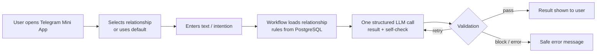
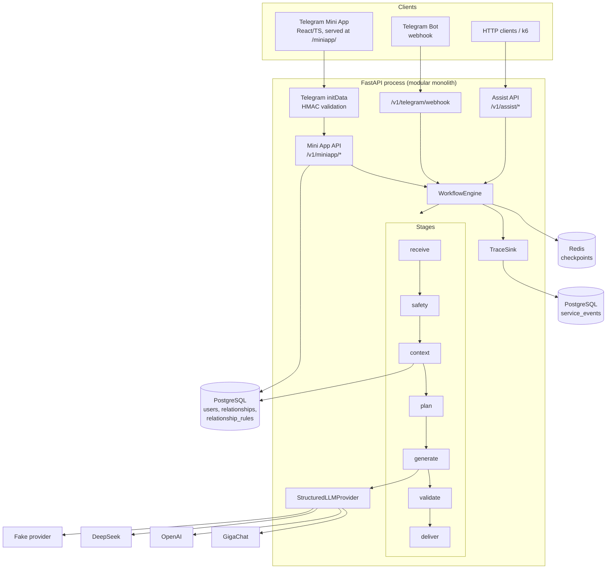
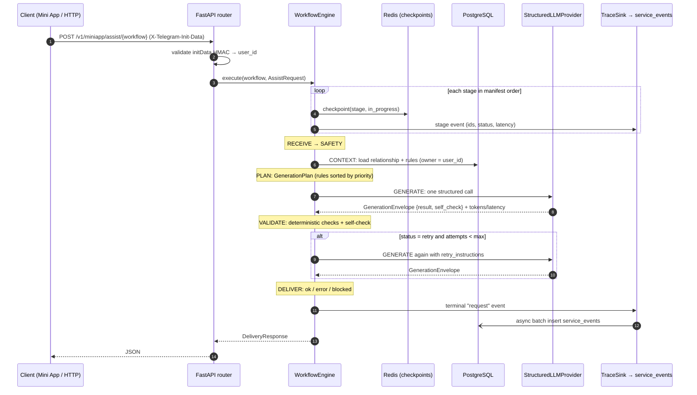
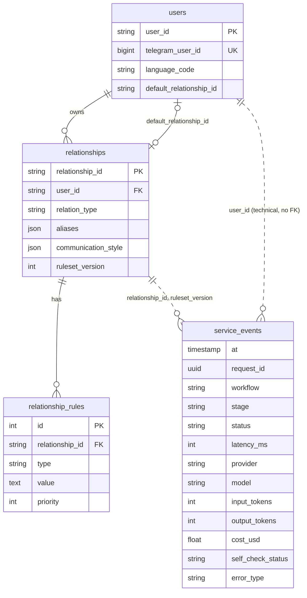
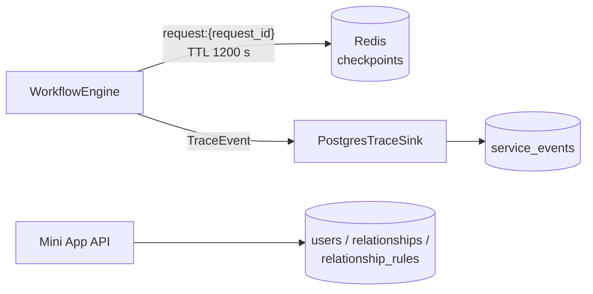
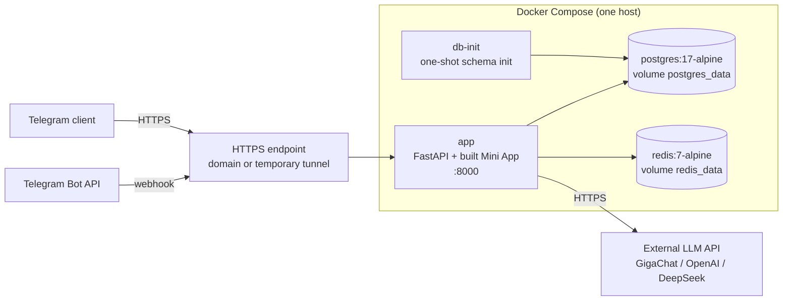

# Svoi Pravila v0.6 — Architecture

This document describes the system as it is **implemented** in v0.6. Planned work is labeled *future improvement*. Known weaknesses are labeled *known limitation*.

Svoi Pravila is a **modular monolith**: one FastAPI process (one Docker image) backed by PostgreSQL and Redis, which calls an external LLM API. It is not a set of microservices.

Related documents: [OBSERVABILITY](OBSERVABILITY.md) · [LOAD_TEST_REPORT](LOAD_TEST_REPORT.md) · [DOCKER_RUN](DOCKER_RUN.md) · [MINIAPP_API](MINIAPP_API.md) · [INTEGRATION](INTEGRATION.md) · [SECURITY_PRIVACY](SECURITY_PRIVACY.md) · [WORKFLOWS](WORKFLOWS.md) · [ARTIFACTS](ARTIFACTS.md) · [CHECKPOINTS](CHECKPOINTS.md)

---

## 1. Product overview

Svoi Pravila ("Your Own Rules") is a communication assistant. People talk differently to a partner, a parent, a manager or a friend. The user records rules for each relationship, such as "don't use the phrase «ты всегда»" or "be direct but warm". Every generation then applies those rules.

| Workflow | Input | Output (structured result) |
|---|---|---|
| `soften` | A message the user wants to send | `SoftenResult`: rewritten message plus the original intent |
| `decode` | A message the user received | `DecodeResult`: literal meaning, probable intent, emotional tone, uncertainty |
| `help-say` | What the user wants to say | `HelpSayResult`: a ready-to-send message plus the preserved intent |

**Why relationship rules matter.** A generic rewriter produces generic text. Svoi Pravila treats rules as per-relationship data with priorities. Each request applies them to the model prompt *and* checks them deterministically. For example, an "avoid" phrase is rejected even if the model ignores the rule.

## 2. Core product loop

## 3. High-level system architecture

Main code locations: `app/main.py` (app factory, `/health`, static `/miniapp`), `app/container.py` (dependency wiring and provider selection), `app/api/` (HTTP, Mini App and Telegram routers), `app/workflows/engine.py` (WorkflowEngine), `app/stages/` (stage handlers), `config/workflows/*.yaml` (workflow manifests), `app/tools/llm/` (providers), `app/repositories/` and `app/persistence/` (storage), `app/checkpoints/` (Redis), and `app/observability/` (tracing and metrics).

## 4. Request lifecycle

Each workflow is a YAML manifest (`config/workflows/{soften,decode,help-say}.yaml`) that lists the same seven stages:

`RECEIVE → SAFETY → CONTEXT → PLAN → GENERATE → VALIDATE → DELIVER`

- **Python controls stage order.** `WorkflowEngine._run_stages` iterates the manifest. The LLM never chooses the next stage.
- Stages exchange **typed Pydantic artifacts**: `MessageRequest`, `SafetyDecision`, `RelationshipContext`, `GenerationPlan`, `SoftenResult`/`DecodeResult`/`HelpSayResult`, `ValidationResult` and `DeliveryResponse`. Each artifact is validated after its stage runs.
- **Relationship rules are dynamic data.** They are loaded at runtime in the CONTEXT stage and never compiled into code.
- **The normal path makes exactly one LLM call** (GENERATE).
- **Retries happen only on validation failure.** If VALIDATE returns `retry`, the engine jumps back to `generate` (manifest `retry.max_attempts: 2`) and passes `retry_instructions` along.
- **A missing or malformed self-check in `required` mode blocks delivery without a retry.** A retry would cost another provider call. DELIVER then returns `status="error"`.
- A checkpoint is written to Redis before and after every stage, so a request can be resumed (`WorkflowEngine.resume`).

## 5. Relationship and rules architecture

| Concept | Implementation |
|---|---|
| User | `users` table. `user_id` is derived from the validated Telegram identity; it also stores Telegram profile fields and `default_relationship_id`. |
| Relationship | `relationships` table: `relationship_id`, owner `user_id`, `relation_type`, `aliases` (JSON list, e.g. "мама"), `communication_style` (JSON, e.g. `tone`/`firmness`), `ruleset_version` |
| Rule | `relationship_rules` table: `type` (e.g. `avoid`), `value` (free text), `priority` |
| ruleset_version | Incremented when rules change. Copied into `RelationshipContext` and recorded in `service_events` so each result can be traced to the ruleset used. |
| Default relationship | Used when the request has no `relationship_id`. Set via `PUT /v1/miniapp/me/default-relationship/{id}`. |
| Ownership isolation | Every repository lookup is scoped by `(user_id, relationship_id)`. On the Mini App API, `user_id` comes only from validated initData and never from the client body. A foreign `relationship_id` resolves to nothing. |

**How rules reach the model:**

1. `ContextStage` loads the record and builds a `RelationshipContext`. With no record, the context is empty and `ruleset_version=0`.
2. `PlanningStage` builds a `GenerationPlan`. Its `constraints` are the safety instructions followed by the rule values sorted by `priority` (descending). `tone` comes from `communication_style`.
3. `GenerationStage` renders the skill prompt (`skills/`) with the plan and calls the provider.
4. `ValidationStage` re-checks rules that can be checked mechanically (`avoid` phrases).

## 6. LLM architecture

- **`StructuredLLMProvider`** (`app/tools/llm/base.py`) is the only interface business code depends on. The concrete provider is chosen in `app/container.py` from `LLM_PROVIDER`.

| Provider | File | Notes |
|---|---|---|
| GigaChat | `gigachat_provider.py` | REST v1; cached OAuth token; timeout 30 s default |
| OpenAI | `openai_provider.py` | Responses API with structured outputs; 2 SDK retries |
| DeepSeek | `deepseek_provider.py` | JSON-schema text format; timeout 60 s |
| Fake | `fake.py` | Deterministic; used for tests and platform load tests |

- **`GenerationEnvelope`** (`app/artifacts/internal.py`) is the *internal* response shape: `{ result, self_check }`. `LLMGenerateTool` (`app/tools/llm/tool.py`) splits it. `result` becomes the public `SoftenResult`/`DecodeResult`/`HelpSayResult`. `self_check` goes to workflow metadata and is classified as `present`, `missing` or `malformed`.
- **Metadata** recorded per call: provider, model, input/output tokens, `provider_latency_ms`, and `cost_usd` (null when the provider doesn't report it, as with GigaChat).
- **The public result schema is separate from the envelope.** API clients and the OpenAPI contract never see `self_check`.
- Self-check mode is `LLM_SELF_CHECK_MODE` = `required` (default) or `observe`.

## 7. Validation architecture

**A. Deterministic validation** (`app/stages/validation.py`). This is the authority; a model self-check can never override it.

- Structure and schema: Pydantic validates the provider output against the workflow result model. Required fields must be non-empty (`non_empty_rewrite`, `intent_recorded`, `uncertainty_present`, `probable_not_certain`, `non_empty_message`, `intent_preserved`).
- Exact-phrase checks: `avoid` rules are matched case-insensitively and whole-word against the output, using quoted phrases inside the rule (`app/stages/constraints.py`).
- Russian commitment guard (`app/stages/commitments.py`): rejects invented promises such as «я обещаю» or «мы будем» in `help-say` when the user did not express them. *Known limitation*: this is a **frozen temporary regression guard**, Russian only, and is not meant to grow into a rules engine.

**B. Semantic self-check.** The model returns structured evidence about rule compliance as part of the same call.

- An explicit self-reported failure causes `retry`, with instructions that reference the known rule ids.
- A self-reported pass is only *evidence*. The deterministic checks still decide.
- If the self-check is missing or malformed in `required` mode, the result is `block`, with no retry.

There is **no per-user Python code**. All relationship-specific behavior is data (rules, style) interpreted by generic stages.

`SafetyStage` is currently a pass-through placeholder that never blocks. *Known limitation / future improvement*: a dedicated moderation provider.

## 8. Data architecture

- **PostgreSQL** stores durable configuration (users, relationships, rules) and telemetry (`service_events`). The schema is created by `db-init` (`scripts/init_db.py`, `migrations/`).
- **Redis** stores temporary, resumable workflow state: key `request:{request_id}`, TTL `REDIS_CHECKPOINT_TTL_SECONDS` (default 1200 s).
- **Raw messages are not stored in PostgreSQL observability.** `service_events` has only technical columns.
- *Known limitation*: Redis checkpoints **do** temporarily contain active request state, including the input text and generated artifacts, until the TTL expires. This is what makes resuming a request possible.

## 9. Observability architecture

- `TraceEvent`/`RequestTrace` (`app/observability/trace.py`) are emitted by the engine for every stage and once per request (`stage="request"`, terminal status, `generate_attempts`, `error_type`).
- The `TraceSink` protocol is implemented by `PostgresTraceSink` (`app/observability/postgres_sink.py`). It buffers a request's events and writes them in one async multi-row insert into `service_events`, using an allow-list of technical fields only.
- The following are derived (`app/observability/metrics.py`, `scripts/export_metrics.py`): **DAU** (distinct `user_id`), request frequency per workflow, error and status distribution, latency p50/p95/p99, provider latency, tokens and TPM, provider/model breakdown, retry rate, `self_check_status`, and cost (null if not reported). Results can be exported as **CSV/JSON**.
- No raw prompt, message or model output is stored.

Details: [OBSERVABILITY.md](OBSERVABILITY.md).

## 10. Deployment architecture

| Service | Role |
|---|---|
| `app` | One image holding FastAPI and the built React Mini App (`frontend/dist`), served from **`/miniapp/`**. Port 8000. Starts after postgres/redis are healthy and db-init has succeeded. |
| `postgres` | PostgreSQL 17. Port bound to `127.0.0.1:5432`. |
| `redis` | Redis 7. Port bound to `127.0.0.1:6379`. |
| `db-init` | One-shot `python scripts/init_db.py`. |

Telegram requires an **HTTPS** URL for the Mini App and the webhook. *Known limitation*: so far this has been tested only through a **temporary HTTPS tunnel**. A permanent public domain and deployment are a future improvement. See [DOCKER_RUN.md](DOCKER_RUN.md) and [PRODUCTION_RUNTIME.md](PRODUCTION_RUNTIME.md).

## 11. Performance and scaling

From [LOAD_TEST_REPORT.md](LOAD_TEST_REPORT.md) (k6; local laptop; single uvicorn process):

- **Platform (fake provider): 10 RPS PASS.** 601 requests over 60 s, 0% errors, p50 23 ms, p95 31 ms, p99 42 ms.
- **Stress (fake provider): up to 50 RPS with 0% errors.** p95 48 ms and p99 171 ms at 50 RPS. App CPU (one process) is the first resource to grow. PostgreSQL stayed at ≤11% CPU and Redis at ≤8%. No breaking point was reached.
- **Real GigaChat: externally constrained.** At 0.2 RPS, p50 was 2.29 s and p95 9.57 s, and 1 of 12 requests got **HTTP 429** (rate limit). Under the safety rules the ramp stopped there.

Scaling path (*future improvement*): run multiple uvicorn workers or app replicas (the app is stateless apart from Redis/PostgreSQL), add a provider concurrency limiter with 429 backoff, and get a higher provider quota.

## 12. Security and privacy

- **Telegram initData HMAC-SHA256 validation** (`app/integrations/telegram/miniapp_auth.py`): the secret is derived from the bot token, and `auth_date` freshness is enforced (`TELEGRAM_INIT_DATA_MAX_AGE_SECONDS`, default 3600). initData is re-validated on every Mini App request.
- **Ownership checks**: the user identity comes from initData only. Relationships and rules are always looked up by owner.
- **Telemetry stores no raw messages**: only allow-listed technical fields go into `service_events`.
- **Secrets** (`TELEGRAM_BOT_TOKEN`, `GIGACHAT_CREDENTIALS`, `OPENAI_API_KEY`, `DEEPSEEK_API_KEY`, `TELEGRAM_WEBHOOK_SECRET`) live in `.env`, which is git-ignored. Only `.env.example` with placeholders is committed.
- **Relationship rules are untrusted user data.** They are placed into the prompt as constraints, and system/skill instructions take precedence. Rules cannot change the stage order, the output schema or the validation logic.

More detail: [SECURITY_PRIVACY.md](SECURITY_PRIVACY.md).

## 13. Failure behavior

| Situation | Behavior |
|---|---|
| Provider timeout | `LLMTimeoutError` → **HTTP 504**. The request ends `failed`, with `error_type=LLMTimeoutError` in `service_events`. No retry. |
No automatic retry, to protect the latency budget. *Known limitation*: there is no 429 backoff, provider concurrency limiter or queue. |
| Provider unavailable (upstream 5xx) | `LLMUnavailableError` → **HTTP 503**. |
| Unexpected internal error | **HTTP 500**. *Known limitation*: typed 429/503/504 classification is implemented for GigaChat only; other providers' failures still return 500. |
| Validation failure | `retry` → regenerate with `retry_instructions`, up to the manifest's `max_attempts`. If it still fails, DELIVER returns a controlled HTTP 200 with `status="error"` and a safe message localized by request `language` (ru/en/he; variants such as `en-US` use the base language; unknown languages get English). |
| Blocked result | When SAFETY returns `block`, the engine returns `status="blocked"` immediately. The SafetyStage placeholder currently never blocks. |
| Required self-check missing/malformed | VALIDATE returns `block` with no retry, and DELIVER returns `status="error"`. |
| Observability persistence failure | The sink isolates errors: writes run in the background and failures are swallowed or logged. Tracing never changes the user's response. |
| Process restart mid-request | The Redis checkpoint lets `WorkflowEngine.resume(request_id)` continue from the last completed stage until the TTL expires. |

## 14. Current limitations

- **GigaChat latency exceeds the 1.5 s target**: p50 about 2.3–2.4 s, with outliers near 10 s.
- **The current GigaChat quota limits real throughput**: HTTP 429 at 0.2 RPS.
- **GigaChat does not report `cost_usd`.** Token usage is measured, but a pricing model is still needed for cost/DAU.
- **The quick HTTPS tunnel is not a production deployment.** There is no permanent public URL yet.
- The SafetyStage is a placeholder, and there is no moderation provider.
- The Russian commitment guard is a frozen, Russian-only heuristic.
- There is no 429 backoff, provider concurrency limiter or queue/worker layer.
- The app runs as a single process. Horizontal scaling hasn't been exercised.
- Redis checkpoints temporarily hold request text (TTL 20 min).
- Schema management uses an init script rather than Alembic migrations.

## 15. Technical MVP acceptance status

| # | Criterion | Status | Notes |
|---|---|---|---|
| 1 | Load test / TPM / TPS / stress | **PARTIAL** | Platform PASS (10 RPS, stress to 50 RPS). Real provider is constrained by GigaChat quota and latency. |
| 2 | Architecture | **PASS** | This document |
| 3 | README | **PASS** | [README.md](../README.md) |
| 4 | Metrics / logging | **PASS** | `service_events`, exports |
| 5 | LLM cost / DAU | **PARTIAL** | Tokens and DAU are measured. GigaChat doesn't report cost, so a pricing model is still needed. |
| 6 | Non-localhost deployment | **PARTIAL** | A temporary HTTPS tunnel was tested. A permanent public deployment is still needed. |
