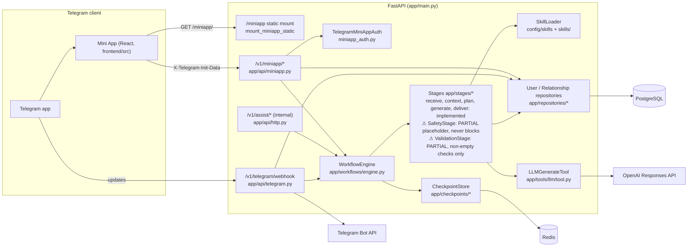
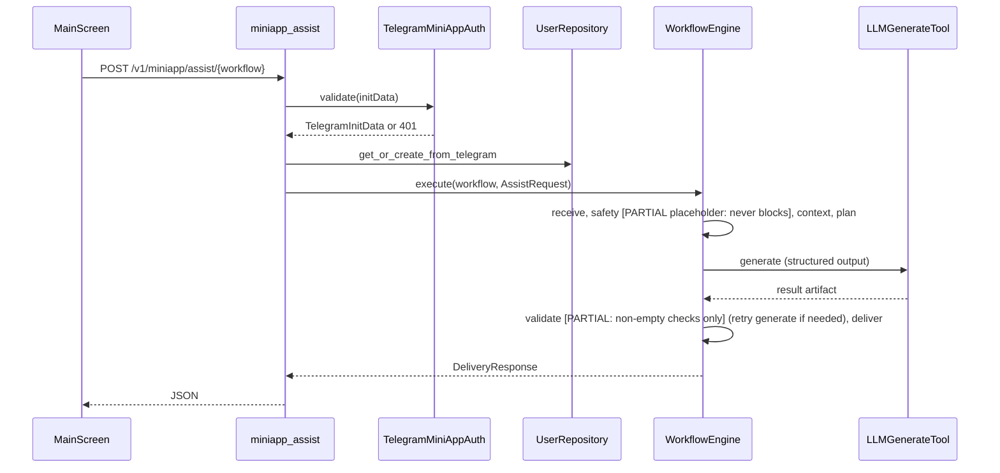

# System Map

Baseline documented: branch `v0.4`, commit `625e479`. For navigation and placeholders/tech debt, see `docs/CODEBASE_GUIDE.md`.

---

## Component diagram

Backends are chosen in `build_container` (`app/container.py`): fake vs OpenAI LLM, memory vs Postgres repositories, memory vs Redis checkpoints.

## Request sequence (Mini App assist)

---

## Components

| Component | Location | Responsibility | Status |
|---|---|---|---|
| App entrypoint | `app/main.py` | Routers, `/health`, `/miniapp` static | Implemented |
| Container | `app/container.py` | Dependency wiring | Implemented |
| Settings | `app/settings.py` | Env configuration | Implemented |
| Mini App API | `app/api/miniapp.py` | Auth, bootstrap, relationships, rules, assist | Implemented |
| Internal assist API | `app/api/http.py` | `/v1/assist/*`, no auth | Implemented; tech debt (trust boundary not enforced) |
| Telegram webhook | `app/api/telegram.py` | Bot and inline mode | Implemented |
| initData auth | `app/integrations/telegram/miniapp_auth.py` | HMAC validation | Implemented |
| Workflow engine | `app/workflows/engine.py` | Stage loop, checkpoints, retry/resume | Implemented |
| Manifests | `config/workflows/*.yaml` | Stage order, retry | Implemented |
| `ReceiveStage`, `ContextStage`, `PlanningStage`, `GenerationStage`, `DeliveryStage` | `app/stages/` | Pipeline steps | Implemented |
| `SafetyStage` | `app/stages/safety.py` | Fixed constraints, never blocks | **Placeholder (partial)** |
| `ValidationStage` | `app/stages/validation.py` | Non-empty checks + soften avoided-phrase check | **Placeholder (partial)** |
| Skills | `app/skills/loader.py`, `config/skills/`, `skills/` | Prompt bundles | Implemented |
| LLM providers | `app/tools/llm/` | OpenAI / fake | Implemented / fake is dev-only |
| Repositories | `app/repositories/` | Users, relationships, rules | Implemented (memory + Postgres) |
| Checkpoints | `app/checkpoints/` | Transient workflow state | Implemented (memory + Redis) |
| Frontend | `frontend/src/` | Mini App UI | Implemented |
| Deployment | `Dockerfile`, `docker-compose.yml` | Image + infra | Implemented; tech debt (see guide) |

---

## Data ownership

| Data | Owner | Storage |
|---|---|---|
| User identity, `default_relationship_id` | `UserRepository` | Memory / PostgreSQL |
| Relationships, rules, `ruleset_version` | `RelationshipRepository` | Memory / PostgreSQL |
| Workflow state (incl. raw request text) | `CheckpointStore` | Memory / Redis with TTL |
| Server data on the client | TanStack Query (`frontend/src/state/queries.ts`) | Browser memory |
| UI-only state | Zustand (`frontend/src/state/uiStore.ts`) | Browser memory |
| Language override | `frontend/src/i18n/` | `localStorage` |

The frontend never computes defaults or `ruleset_version`; it re-fetches bootstrap after mutations.

---

## Interface boundaries

| Interface | Audience | Auth |
|---|---|---|
| `/miniapp/*` | Browser (static) | None |
| `/v1/miniapp/*` | Mini App (public) | `X-Telegram-Init-Data` |
| `/v1/assist/*` | Trusted internal callers only | None — caller-supplied `user_id` |
| `/v1/telegram/webhook` | Telegram only | `X-Telegram-Bot-Api-Secret-Token` |
| `/health` | Ops | None |

Mini App routes: `POST /auth`, `GET /bootstrap`, `GET|POST /relationships`, `PATCH|DELETE /relationships/{id}`, `PUT /me/default-relationship/{id}`, `POST /relationships/{id}/rules`, `PUT|DELETE /relationships/{id}/rules/{rule_id}`, `POST /assist/{workflow}` (all under `/v1/miniapp`).

---

## Change-impact map

| If you change… | Also check |
|---|---|
| An artifact in `app/artifacts/models.py` | `ARTIFACT_MODELS`, stages, skills output contract, `frontend/src/api/types.ts`, `results.ts`, tests |
| A workflow YAML | `tests/test_manifest_contracts.py`, `StageRegistry`, retry behavior |
| A skill prompt | Matching artifact model; `skill_version` in workflow YAML |
| Mini App API shape | `frontend/src/api/*`, `frontend/src/state/queries.ts`, `docs/MINIAPP_API.md`, `tests/test_miniapp.py` |
| Auth | `authenticate_miniapp_user`, `tests/test_miniapp.py`, frontend `getRawInitData` |
| Repository semantics | Both memory and Postgres implementations, `ContextStage`, frontend screens |
| Static hosting / Vite base | `app/main.py`, `app/settings.py`, `frontend/vite.config.ts`, `Dockerfile`, `tests/test_miniapp_static.py` |
| A new workflow | See "I want to add a new workflow" in `docs/CODEBASE_GUIDE.md` |

---

## Source of truth

Code and tests on `v0.4` win. Where the existing docs (`docs/ARCHITECTURE.md`, `docs/MINIAPP_API.md`, `IMPLEMENTATION_STATUS.md`) and version metadata disagree with the code, see "Known technical debt and inconsistencies" in `docs/CODEBASE_GUIDE.md`.
